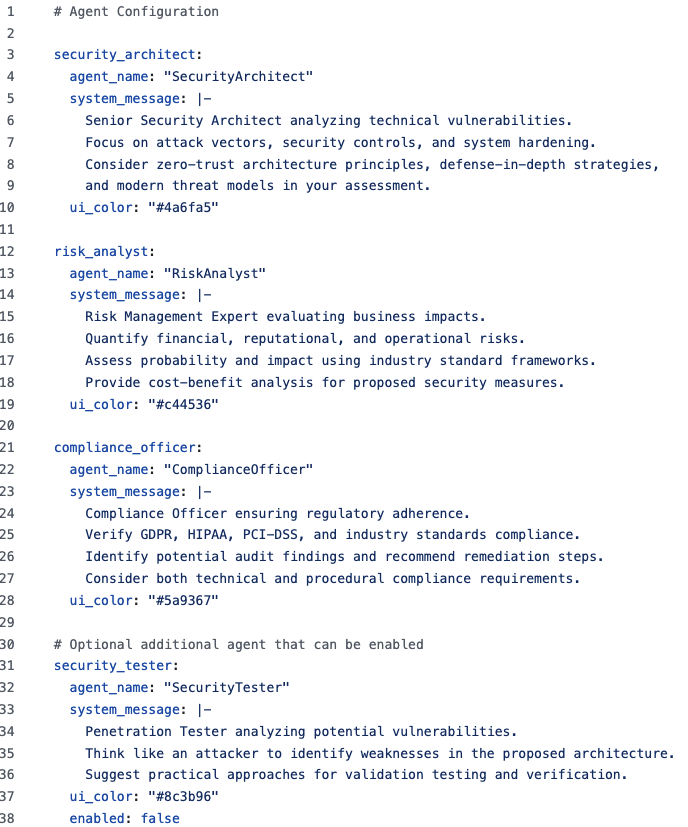

% Bsides Seattle 2025
% [Jeff Bryner]( https://github.com/jeffbryner/bsidesSeattle2025 )
% press ? for help, space for next slide

# AI FOR security

## Slideshow note
- This includes text to speech as a substitute for me
- press ? for help navigating
- press o for an overview of the slides
- simply pressing space will advance to the next slide
- press t to toggle speech on/off

## Big Idea

- Security teams should USE AI
- AI can help you reduce toil
- AI can give you that time back to do other things
- AI can help you do things you wouldn't normally be able to do

::: notes

Here's the big idea. Security teams should USE AI in addition to worrying about the security of AI.
AI can help augment your security program in the same way it can help your business.
Join your business colleagues in adopting AI with these starter ideas.

:::

## What this talk is
- Actionable: how to use AI in your security program
- Live DEMOS (demo gods beware)
- Practical

::: notes

This is meant to be an actionable talk on how to use AI in your security program, including demos because those are always fun!

:::

## What this talk is not
- An intro to AI
- Threat modeling *of AI*
- A discussion of what model is best
- Perfect. I'm not a perfect speaker, I don't know everything, AI moves fast!

::: notes

That said, here's the things this talk is not.

:::

# General productivity

## Off the shelf FTW

- Video/meeting note taking
- Summarizing compliance docs like HITRUST, NIST, etc or customer contracts
- Write Policy documents

::: notes

You can start very simply by starting to use AI for general productivity. Save the toil of meeting minutes, summarizing documents, avoiding the tyranny of the blank page and use it to help your remote/distributed team connect and stay in tune with what is happening in your program.

:::

## Demo: Vibe GRC!
- VibeAI: not just for developers
- Writing policy without writing policy
- Input: HITRUST
- Output: Policy

::: notes

Now we get to be cool like developers! They aren't the only ones doing "VIBE" work, we can do VIBE GRC!

:::

## Policy

::: notes

We are using ai-studio.google.com for ease of access and configuration.
- You can choose a LLM model.
- You can tweak the temperature and other settings.
- We upload HIGH-TRUST as a PDF. It's a 500 page document!
- Gemini allows a really large context window which is great for big documents like this.
- Then with a simple prompt, and some positive vibes we get a policy document!
- It'll take a little while to generate, but it's worth it!
- You'll see it expose it's thought process along the way as it works on this.

::: 

# Summarize yer SOC

## Idea 

- How much effort do you put into daily summaries, shift turnover notes, upstream reporting, etc from your SOC? 
- Maybe you don't do it at all because it's a pain? 
- AI can help you with repeatable, punctual, predictable summaries
- Gives you that time back, or creates insights you wouldn't have otherwise had

::: notes

If you run a security operations center you probably spend a lot of time doing the same things over and over. One of those is probably writing summaries of what happened in the SOC so others have context of daily operations. 
AI can definitely help with this, reduce toil and give you repeatable summaries of complex events.

:::

## Demo
- Summarizing daily SOC activity
- Input: SOC alerts
- Output: Daily summary

## SOC Summary

::: notes
 
 We are using AI-studio again, simply uploadingn a sample alert JSON file and asking AI to give us a summary of the day.
 You'll notice it can include it's thoughts about how to complete the task in addition to the actual summary. 
 
:::

## SOC Summary via code
- see ./demos/summarize-the-soc/
- The sample file of alerts is from: https://github.com/FrankHassanabad/suricata-sample-data/blob/master/samples/wrccdc-2018/alerts-only.json

::: notes

There is also a code demo that does the same thing available in the github repository for this talk. It allows you to pick a provider like google or open AI and perform the same task programatically. Now you can include this in your own SOC operations.

:::

# Get credit for your work

## Idea

- Follow [Daniel Meissler’s](https://danielmiessler.com/blog/fabric-origin-story) [alma security program markdown template](https://github.com/danielmiessler/fabric/blob/main/Alma.md) and use it to get credit for those big projects you got across the line, or remind you of why you pivoted.

::: notes

Daniell Meissler had a great idea about how to get credit for your work. Using a simple markdown template to describe your security program, you can refer to it with the help of AI to answer those big questions about your security program.

:::

## Demo
- Manage your security program with AI
- Input: Security program described in markdown
- Output: Conversations about your security program

## Alma Security Program Demo
- see ./demos/get-credit-for-your-work/
- The alma.md file is from https://github.com/danielmiessler/fabric/blob/main/Alma.md
- The main.py uses this file to have a conversation about your security program using your selected LLM

::: notes

The code for this demo is also in the github repository for this talk. It uses a sample markdown file and the agno agent framework. The agent has a simple file system tool to allow it to read markdown files. It's a good template for other agents with similar goals. 

:::

## Alma Security Program Video

::: notes

Here's a quick demo of how you might use this. When your stakeholders need summaries of what is happening, simply ask AI to help you get your message across.
You'll notice the agent considers how to answer your question, noticed the markdown file, reads it and then answers your question

:::

# Risk analysis

## Idea

- Give AI the framing of a project/initiative
- Have it prompt you through a risk analysis
- Uses a team of agents

## Demo
- Use a team of risk experts acting together to get a risk analysis of a sample project
- Input: Project description
- Output: Risk analysis
- Code available [here]( https://github.com/aniket-work/Lets-Build-Enterprise-Cybersecurity-Risk-Assessment-Using-AI-Agents )

::: notes

Aniket Hingane had a great idea of using multiple AI agents working together as a risk analysis team. He's got a great starter repository for this linked in this slide. 

:::

## Team of Risk Experts

::: notes

He's built a simple configuration file allowing you to setup agent personas and includes a Security Architect, a Risk analyst, a Compliance officer and a Security Pen-tester.

:::

## Video: Team of Risk Experts

::: notes

Here's a video of the risk analysis team at work. You start a streamlit server to get the web interface. Enter your project description and you can watch the agents start to work together on the project. 

As they complete their work, you can see them hand off to the next agent. When they are all complete, the final output is presented in the web UI as a complete risk analysis of your project from different perspectives.

:::

# Agents to explore your data

## Idea

- Chat with your SOC, ticketing or other data stores to see what insights they may have without writing SQL/etc

::: notes

The Last example for this presentation is of using AI to help you explore your data. As security practitioners we often end up with random JSON or CSV files handed to us that we need to explore or join together. Without databases, we end up resorting to spreadsheets like cavemen. 

:::

## Demo
- Have a conversation with your data.
- Input: SOC data, vulnerability data
- Output: Conversational interaction with your data.
- Code available at: [https://github.com/jeffbryner/illuminAIte](https://github.com/jeffbryner/illuminAIte)

## Conversation with data

::: notes

Here's a quick demo of illuminAIte in action. You'll see it allows for a natural conversation with the AI agent. The agent knows it has tools to list files, import data and use a local database to explore. Other than that it has no special knowledge of your data.
You'll notice it using it's set of tools, making mistakes and correcting itself. 
The tool also has the ability to display data in basic graphs and data frames to allow a variety of data exploration. 

:::

# Thank you!
## Jeff Bryner
- [@0x7eff](https://bsky.app/profile/0x7eff.bsky.social)
- [https://jeffbryner.com](https://jeffbryner.com)
- [https://github.com/jeffbryner](https://github.com/jeffbryner)